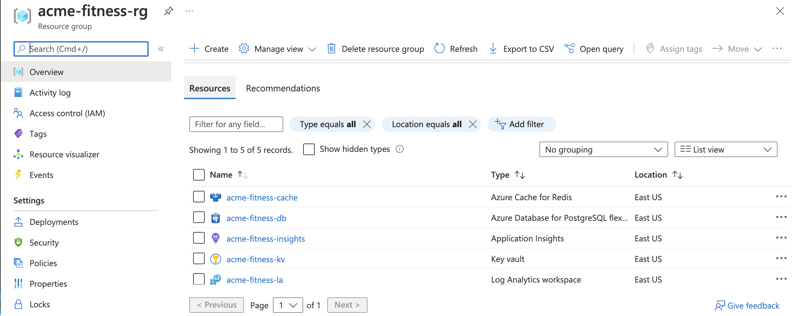
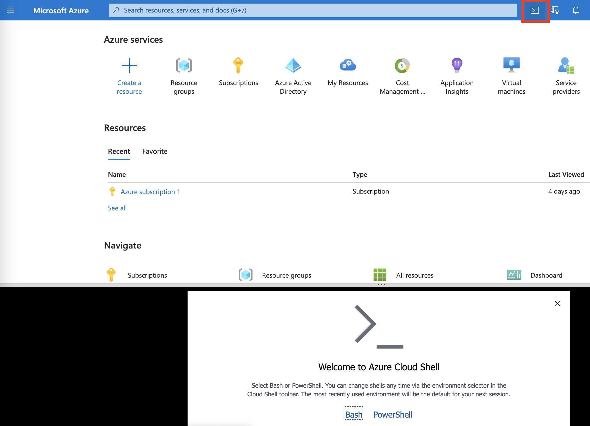

**NOTE** 
You need to give your instructor your personal e-mail id so that they will give you an access to the resource group 'acme-fitness-rg-asaXX', XX is the two digit numbers. Each resource group has following services deployed.
 - 
 - Azure Cache for Redis
 - Azure Database for Postgres
 - Azure Key Vault
 - Log Analytics workspace
 - Application Insights workspace



## Setup your environment for the workshop

   1. * [JDK 17](https://docs.microsoft.com/java/openjdk/download?WT.mc_id=azurespringcloud-github-judubois#openjdk-17)
   2. * VSCode, IntelliJ, Eclipse or any other IDE of your choice
   3. * [Azure CLI version 2.46.0 or higher](https://docs.microsoft.com/cli/azure/install-azure-cli?view=azure-cli-latest) version 2.46.0 or later. You can check the version of your current Azure CLI installation by running:

    ```bash
    az --version
    ```

> Note: You could use Cloud Shell on Azure portal without installing Azure CLI. As all the steps in the workshop are written based on Linux, Cloud Shell could be easier for those of who are not familiar with reading and replacing those with Windows equivalent.


 
## Azure Portal URL 

[Azure Portal URL](https://portal.azure.com/178a8599-6632-4140-964d-4c3de509a859)

## Prepare your environment for Azure Spring Apps Enterprise deployment

Create a bash script with environment variables by making a copy of the supplied template:

Open `./scripts/setup-env-variables.sh` and update the following variables:

```shell
export SPRING_APPS_SERVICE=acme-fitness-asa##
export LOG_ANALYTICS_WORKSPACE=acme-fitness-la-asa##]
```

This env file comes with default values that were provided as part of arm template. It is recommended to leave the values as-is for the purpose of this workshop. If for any reason you updated these default values in the arm template, those values need to be entered in here.

Now, set the environment:

```shell
source ./scripts/setup-env-variables.sh
``` 

### Login to Azure

Login to the Azure CLI and choose your active subscription. 

```shell
az login --use-device-code
az account list -o table
az account set --subscription ${SUBSCRIPTION}
```
## Create ASA-E instance

In this section we are going to create an ASA-E instance using azure cli.

Prepare a name for your Azure Spring Apps service.  The name must be between 4 and 32 characters long and can contain only lowercase letters, numbers, and hyphens.  The first character of the service name must be a letter and the last character must be either a letter or a number. 

This name is stored as an environment variable, SPRING_APPS_SERVICE in ```./scripts/setup-env-variables.sh```. It is defaulted to acme-fitness. It is recommended to leave the default value for this workshop purpose. If you are changing the default name, please note that the name cannot exceed 32 characters.

### Create an instance of Azure Spring Apps Enterprise.

```shell
az spring create --name ${SPRING_APPS_SERVICE} \
    --resource-group ${RESOURCE_GROUP} \
    --location ${REGION} \
    --sku Enterprise \
    --enable-application-configuration-service \
    --enable-service-registry \
    --enable-gateway \
    --enable-api-portal \
    --build-pool-size S2 
```
> Note: The service instance will take around 15-20 minutes to deploy. You will notice in the above command have arguments to enable application-configuration-service, service-registry, gateway and api-portal. The significance of these services will be discussed in later sections when we introduce a demo microservices application. For now please go ahead and run the above command.

Please wait till the above command is complete before you start running any of the below commands.

Set your default resource group name and cluster name using the following commands:

```shell
az configure --defaults \
    group=${RESOURCE_GROUP} \
    location=${REGION} \
    spring=${SPRING_APPS_SERVICE}
```

If you completed all the steps till here, you have successfully created/installed the following resources
* All the dependent resources required for the workshop are installed via an arm template.
* Required az cli extensions are added and default subscription is set

### Configure Log Analytics workspace

Retrieve the resource ID for the recently create Azure Spring Apps Service and Log Analytics Workspace:

```shell
export LOG_ANALYTICS_RESOURCE_ID=$(az monitor log-analytics workspace show \
    --resource-group ${RESOURCE_GROUP} \
    --workspace-name ${LOG_ANALYTICS_WORKSPACE} | jq -r '.id')

export SPRING_APPS_RESOURCE_ID=$(az spring show \
    --name ${SPRING_APPS_SERVICE} \
    --resource-group ${RESOURCE_GROUP} | jq -r '.id')
```

Configure diagnostic settings for the Azure Spring Apps Service:

```shell
az monitor diagnostic-settings create --name "send-logs-and-metrics-to-log-analytics" \
    --resource ${SPRING_APPS_RESOURCE_ID} \
    --workspace ${LOG_ANALYTICS_RESOURCE_ID} \
    --logs '[
         {
           "category": "ApplicationConsole",
           "enabled": true,
           "retentionPolicy": {
             "enabled": false,
             "days": 0
           }
         },
         {
            "category": "SystemLogs",
            "enabled": true,
            "retentionPolicy": {
              "enabled": false,
              "days": 0
            }
          },
         {
            "category": "IngressLogs",
            "enabled": true,
            "retentionPolicy": {
              "enabled": false,
              "days": 0
             }
           }
       ]' \
       --metrics '[
         {
           "category": "AllMetrics",
           "enabled": true,
           "retentionPolicy": {
             "enabled": false,
             "days": 0
           }
         }
       ]'
```

After successfully completing the above steps you created an azure spring apps enterprise instance. This instance acts as a container to which all the services/apps will be deployed to in the following sections.

---

➡️ Next guide: [01 - Deploy Simple Hello World spring boot app](../02-hol-1-hello-world-app/README.md)