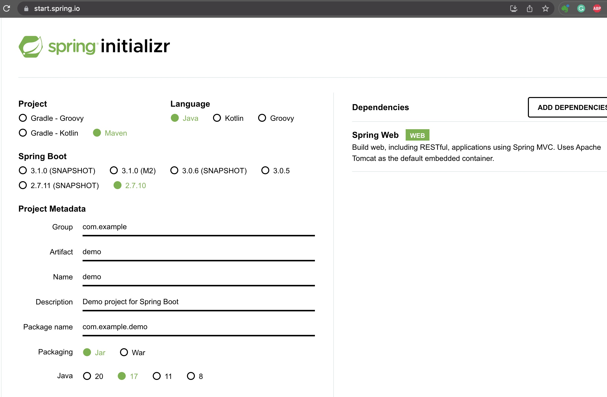
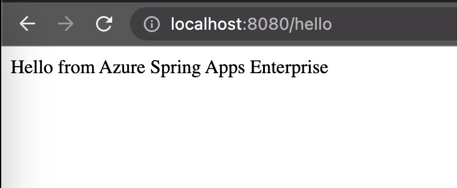

In the previous section you created an empty azure spring apps instance. In this section we will try to deploy a very simple hello-world spring boot app to get a high level understanding of how to deploy an asa-e app and access it. 

---

## Create a Hello World Spring Boot app

A typical way to create Spring Boot applications is to use the Spring Initializer at  [https://start.spring.io/](https://start.spring.io/). 

>💡 __Note:__ All subsequent commands in this workshop should be run from the same directory, except where otherwise indicated via `cd` commands.



> We force the Spring Boot version to be 2.7.10, and keep default settings that use the `com.example.demo` package.

## Add a new Spring MVC Controller

In the `src/main/java/com/example/demo` directory, create a
new file  called `HelloController.java` next to `DemoApplication.java` file with
the following content:

```java
package com.example.demo;

import org.springframework.web.bind.annotation.GetMapping;
import org.springframework.web.bind.annotation.RestController;

@RestController
public class HelloController {

    @GetMapping("/hello")
    public String hello() {
        return "Hello from Azure Spring Apps Enterprise\n";
    }
}
```


## Test the project locally

Run the project:

```bash
cd hello-world
./mvnw spring-boot:run &
cd ..
```

Requesting the `/hello` endpoint should return the "Hello from Azure Spring Apps" message.



Finally, kill running app:

The above step ensures that the hello-world app is up and running locally without any issues.

## Create and deploy the application on Azure Spring Apps instance

### Option 1 - Create the app instance from the Azure portal


### Option 2 - Create the app instance from the Azure CLI

Use the command below to create the app instance from cli:

```bash
az spring app create -n hello-world
This command usually takes minutes to run. Add '--verbose' parameter if needed.
[1/3] Creating app hello-world
[2/3] Creating default deployment with name "default"
[3/3] Updating app "hello-world" (this operation can take a while to complete)
App create succeeded
...
```

You can now build your "hello-world" project and deploy it to Azure Spring Apps Enterprise:

```bash
az spring app deploy -n hello-world --build-env BP_JVM_VERSION=17 --source-path .
```

This creates a jar file on your local disk and uploads it to the app instance you created in the preceding step.  The `az` command will output a result in JSON.  You don't need to pay attention to this output right now, but in the future, you will find it useful for diagnostic and testing purposes.

## Test the project in the cloud

Go to [the Azure portal](https://portal.azure.com/):

- Look for your Azure Spring Apps instance in your resource group
- Click "Apps" in the "Settings" section of the navigation pane and select "hello-world"
- Find the "Test endpoint" in the "Essentials" section.

- This will give you something like:
  `https://primary:<REDACTED>@hello-world.test.azuremicroservices.io/hello-world/default/`
  >💡 Note the text between `https://` and `@`.  These are the basic authentication credentials, without which you will not be authorized to access the service.
- Append `hello/` to the URL.  Failure to do this will result in a "404 not found".

You can now use your web browser to test the `/hello` endpoint, this time served by Azure Spring Apps.  For example.


If successful, you should see the message: `Hello from Azure Spring Apps Enterprise`.

## View Logs

```shell
az spring app logs -s ${SPRING_APPS_SERVICE} -g ${RESOURCE_GROUP} -n hello-world -f
```

## Scale App

```shell
az spring app scale -n hello-world --instance-count 3
```
Once this command is successfully complete, you will find in Azure portal the Running Instance count updated from default 1 to 3.


## Delete the hello-world app
Once you successfully test the hello-world app, please go ahead and delete the app to save on resources. To delete this app, use the below command.

```bash
az spring app delete --name hello-world
```
## Conclusion

Congratulations, you have deployed your first Spring Boot app to Azure Spring Apps!

---

➡️ Previous guide: [01 - Deploy Simple Hello World spring boot app](../02-hol-1-hello-world-app/README.md)

➡️ Next guide: [03 - Hands On Lab 2 - Deploy Frontend app](../03-hol-2-deploy-frontend-app/README.md)
